# Signal-gated mask erosion

Why the harmonization masks are eroded the way they are, and the evidence behind the settings.

**Problem.** Near the sinuses and skull base, T2\* dropout leaves brain-mask voxels with no usable
signal. The field estimate there is unreliable, and background-field artefact leaks from it into the
χ map — a dark wash across inferior temporal and orbitofrontal cortex. Eroding the mask suppresses
it, but a *global* erosion buys that only by peeling healthy cortex just as hard.

**Approach.** Erode only where the signal is actually bad: strip mask *boundary* voxels whose
magnitude is low, iteratively, so the erosion eats inward through dropout territory and stops as
soon as it reaches real signal.

**Setting in use.** `erode_global=1, erode_threshold=0.80, erode_depth_cap=5`, passed by
`scripts/pack_harmonization.py` to the `hd-bet-qsmci` submission's `parameters:` (which default to
off, so the published method is unchanged unless a caller opts in).

All figures below: acquisition `cima-bridge-run1`, pipeline
`laplacian-qsmci → vsharp-qsmrs → rts-qsmrs`, unless stated otherwise. χ windowed at ±0.12 ppm.
Variant shorthand: `eN` = global erosion by N; `sNN`/`rNN` = signal gate at NN% of the in-mask
median on raw / coil-debiased RSS; `cN` = depth cap of N voxels.

## Two corrections that turned out to be load-bearing

### 1. Raw RSS is confounded by the receive-coil bias field

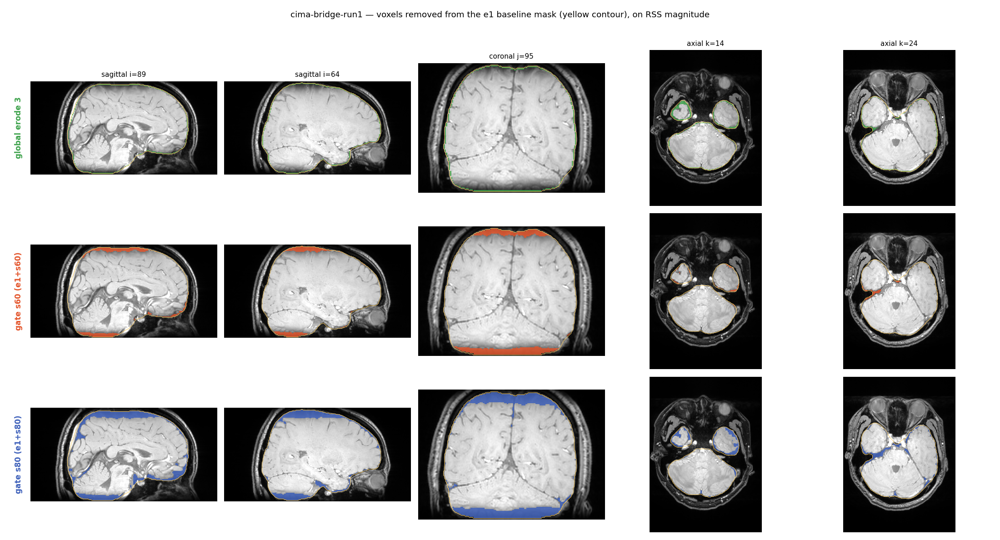

Thresholding raw RSS against a global median mostly flags the **vertex** — far from the receive
coils, so dim, but perfectly healthy — and misses the skull base entirely. Dividing the RSS by its
own mask-normalised smoothed self (σ=12 vox) removes the coil profile: the vertex slice-median goes
0.81 → 1.04 while the skull base stays at 0.16/0.81.

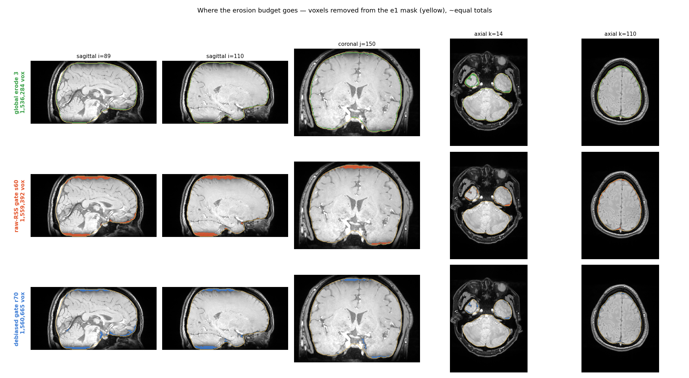

The same erosion budget, spent three ways at ~equal total volume. Global erosion takes a uniform
rind including the vertex; the raw-RSS gate wastes a thick slab on the vertex; the debiased gate
concentrates on the inferior surface, which is the point.

### 2. Without a depth cap the gate carves fjords

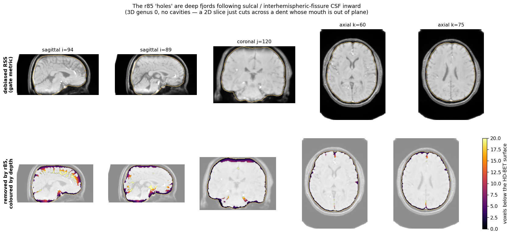

Removals coloured by depth. Sulcal and interhemispheric-fissure CSF is genuinely low-signal *and*
connected all the way inward, so an uncapped peel follows it 15–35 voxels into healthy cortex. These
are **not** topological holes — every mask is genus 0 with no enclosed cavities; a 2D slice simply
cuts across a deep dent whose mouth is out of plane.

Note that deep is not automatically wrong: for `r70`, removals in the 5–15 voxel band are 57–68% at
the skull base, which is the erosion doing its job. Only the >15 tail (286 voxels, 0.17%) is
pathological. A flat cap fixes it, and tested better than a depth-graded "go deeper where the low
region is thick" rule.

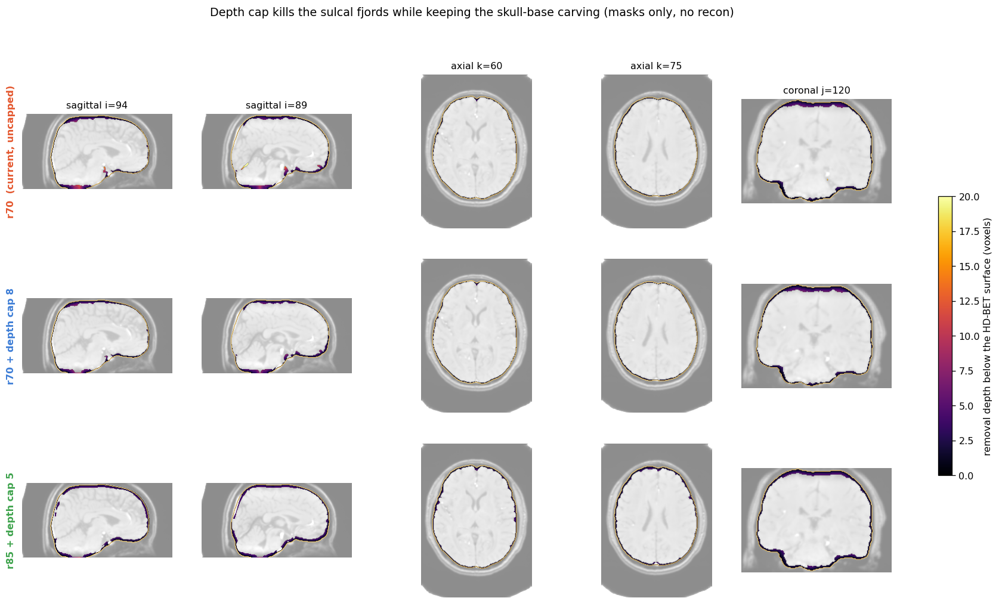

One implementation trap: `distance_transform_edt` only sees zeros *inside* the array, so a brain
touching the FOV face — which happens inferiorly, exactly where the erosion matters — reads as ~15
voxels deep instead of ~1, and the cap then refuses to erode there. Pad the mask first. Worth ~3,100
voxels, 100% of them at the skull base.

## Choosing the settings

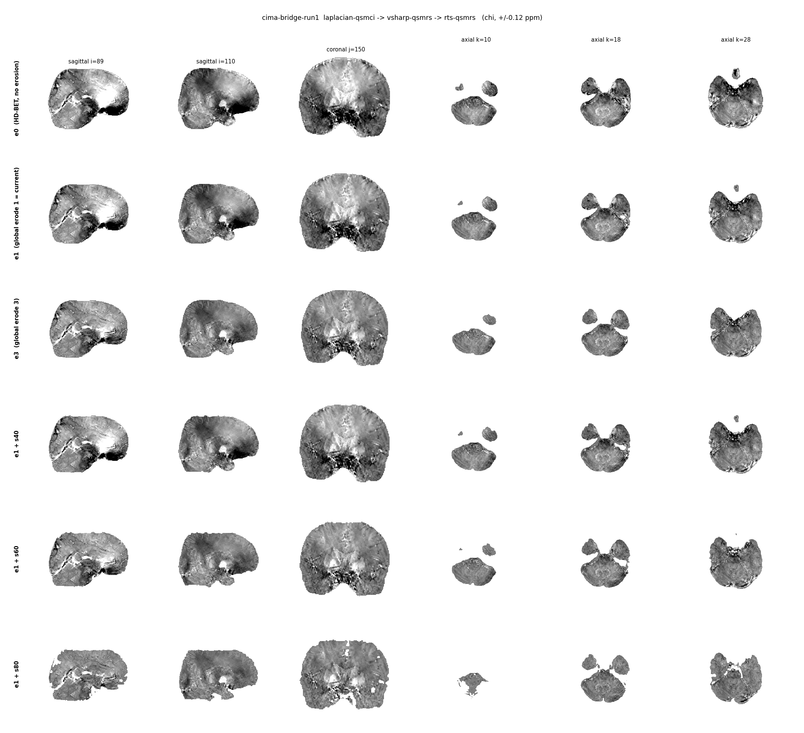
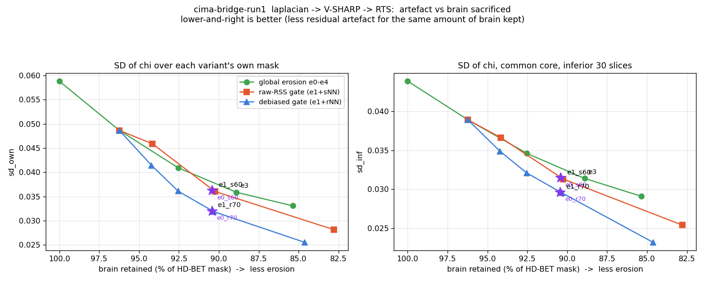
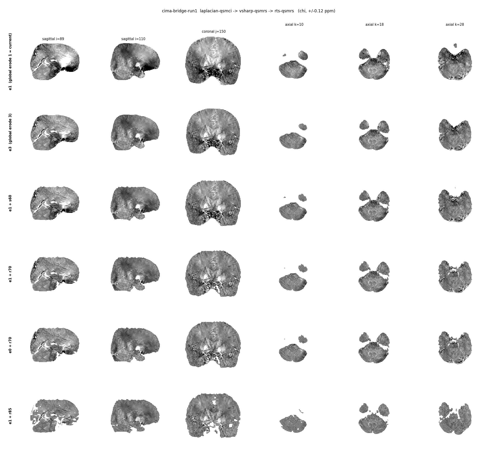

At matched mask volume the debiased gate beats both global erosion and the raw-RSS gate at every
point on the curve. `e0+r70 ≈ e1+r70`, i.e. a preceding global erosion is nearly redundant — though
`erode_global=1` is kept, because a CNN mask often carries a *bright* one-voxel skull/CSF sliver
that no signal gate will ever catch.

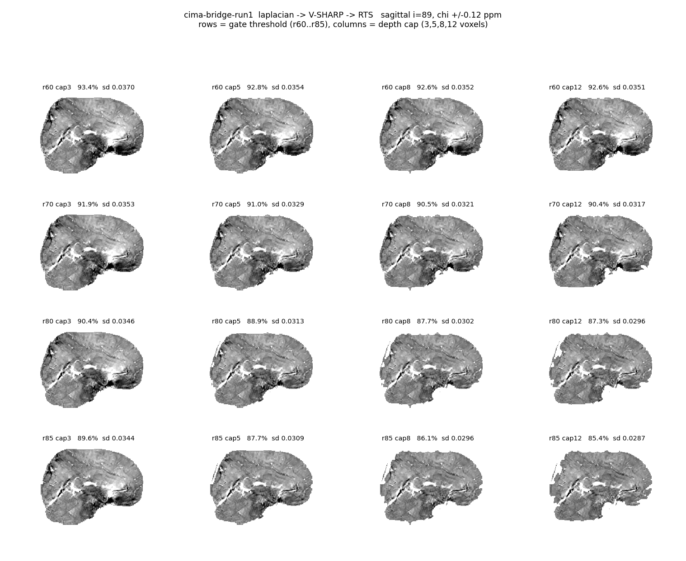
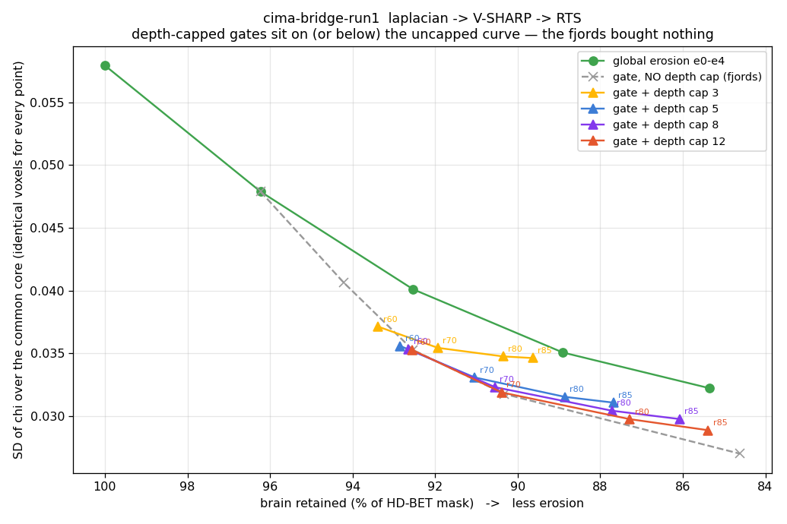

The full threshold × cap grid. Capping costs almost nothing: over the core `r70` and `r70+c8`
share, uncapped scores 0.0328 and capped 0.0335, while the capped mask retains *more* brain (90.5%
vs 90.3%) and drops all 17 in-slice blobs to 0. The fjords were buying nothing.

SD of χ over a fixed common core (identical voxels for every row, so the comparison is controlled):

| mask | brain retained | SD (common core) | in-slice blobs |
|---|---|---|---|
| `e1` (previous production) | 96.2% | 0.0491 | 0 |
| `e3` global | 88.9% | 0.0364 | 0 |
| `e1+s60` raw-RSS gate | 90.2% | 0.0365 | 0 |
| `e1+r70` uncapped | 90.3% | 0.0329 | 17 |
| **`e1+r80+c5` (in use)** | **88.9%** | **0.0327** | **2** |
| `e1+r85+c5` | 87.7% | 0.0322 | 6 |

`r80+cap5` retains exactly as much brain as a global 3-voxel erosion while cutting the χ SD from
0.0364 to 0.0327. Absolute SDs depend on which voxels the shared core covers, so they are
comparable only *within* one table computed over a single core — as this one is.

The grid brackets the setting on both sides. At cap 3 the erosion is too shallow to clear the
skull base: even at the most aggressive threshold it barely improves on a global erosion. At cap
12 the raggedness returns (12–25 in-slice blobs at `r70`–`r85`). Above threshold ~0.85 the gate
starts over-carving regardless of cap.

## All 23 acquisitions

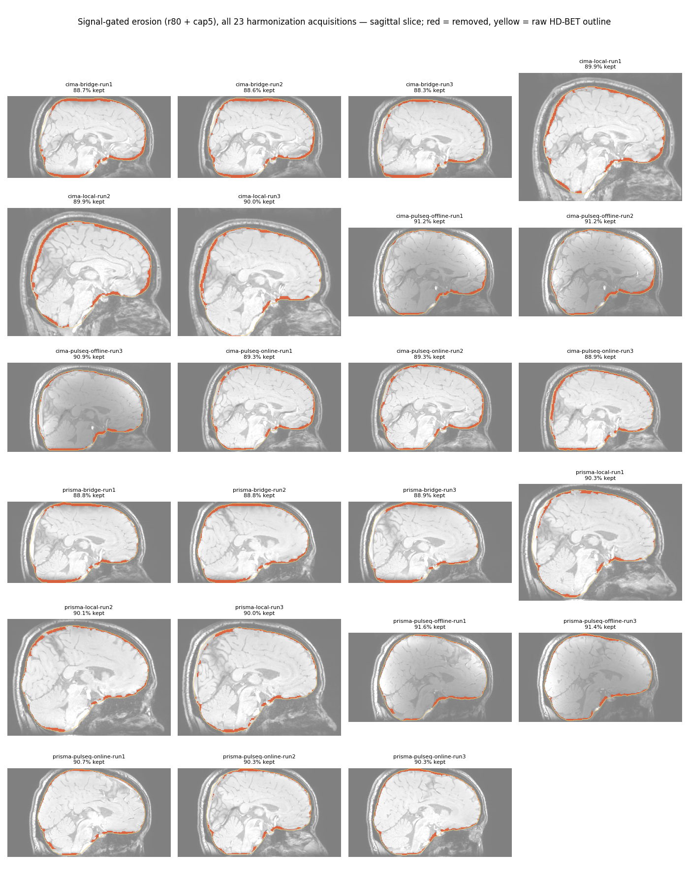
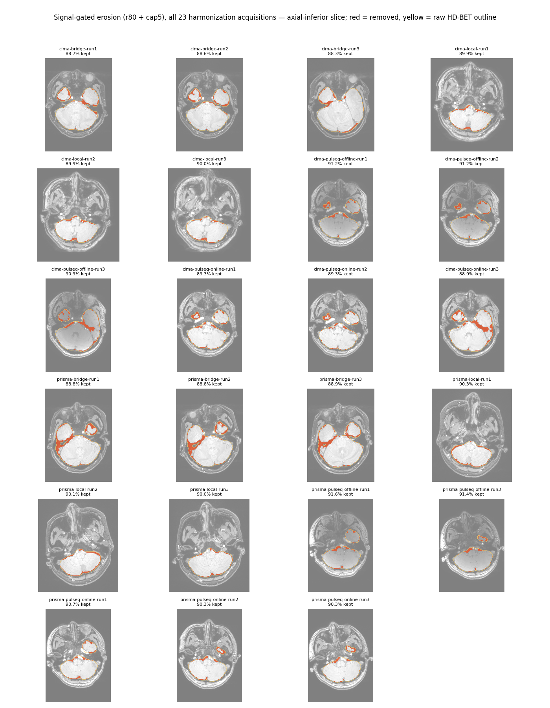

Red = removed, yellow = raw HD-BET outline. Retention 88.3–91.6%, and consistent *across scanners
within protocol* — bridge 88.53% (Cima.X) vs 88.83% (Prisma), local 89.93 vs 90.13, pulseq-offline
91.10 vs 91.50. That matters for a reproducibility study: a mask eroding differently per scanner
would inject a scanner bias straight into the result. `pulseq-online` is the loosest at 89.17 vs
90.43 (1.27 pp) and is worth watching in the reproducibility slopes.

## Caveats

* SD of χ is a proxy for artefact, not ground truth — this dataset has none. The controlled
  common-core comparison and visual inspection are what the choice rests on, not the number alone.
* Settings were selected on one acquisition and one pipeline. The 23-acquisition retention
  consistency above is evidence the normalised threshold transfers, but it is not a per-pipeline
  validation.

## Reproducing

The erosion itself is `_signal_erode` in `algorithms/hd-bet-qsmci/extract.py`; run it through
`qsm-ci run hd-bet-qsmci --magnitude MAG --set erode_global=1 --set erode_threshold=0.80
--set erode_depth_cap=5 -o mask.nii.gz`. The sweep scripts that produced these figures are
experiment scaffolding kept on the compute host under `scripts/repro_slurm/`, not part of the
package.
